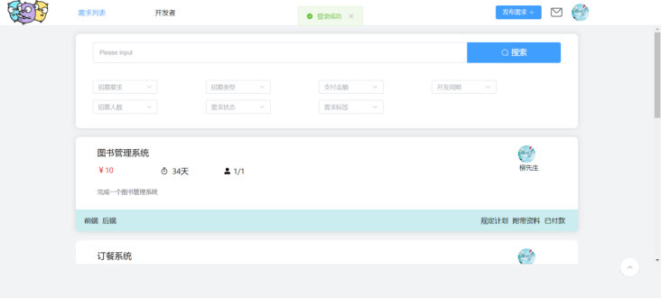
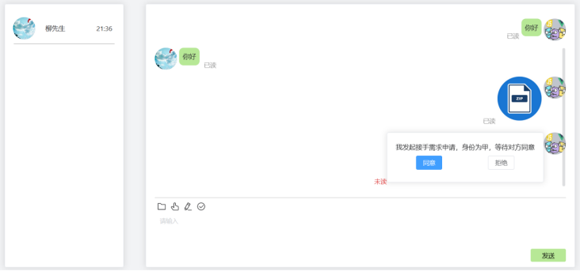
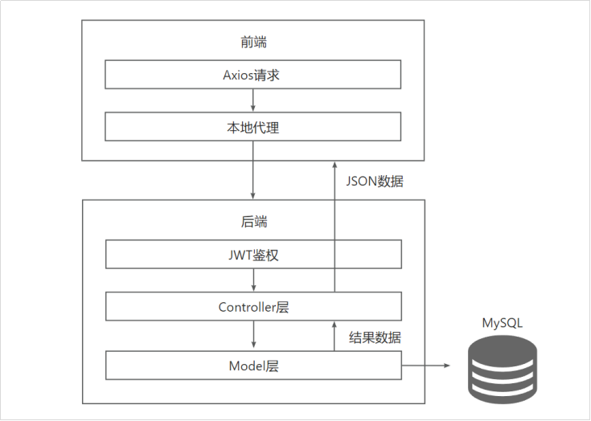

# 软件需求招募系统

一款web端的软件需求招募系统，支持以下功能：

- 需求大厅
- 人才大厅
- 发布需求
- 开发者与雇主聊天
- 聊天支持发送文件，图片
- 开发计划
- 佣金结算

该仓库为软件需求招募系统的前端仓库，使用Vue3，Element-Plus开发。

后端仓库地址：https://github.com/unitiny/RecruitSystem-back.git


## 目录

- [作品及相关架构](#作品及相关架构)
- [上手指南](#上手指南)
    - [安装步骤](#安装步骤)
- [文件目录说明](#文件目录说明)

### 作品及相关架构





### 上手指南

###### **安装步骤**

1. 克隆项目到本地
```sh
git clone https://github.com/unitiny/RecruitSystem-front.git
```

```shell
cd recruit-system
```
2. 安装依赖
```shell
npm install
```
3. 启动
```shell
npm run dev
```

### 文件目录说明

```
recruit-system 
├── /src/  #源码
│  ├── /api/ #api接口
│  ├── /assets/ #资源文件目录
│  ├── /componets/ #封装的组件
│  ├── /router/ #页面路由
│  ├── /static/ #静态全局变量
│  ├── /store/ #状态管理
│  ├── /utils/ #工具函数
│  ├── /views/ #页面
│  ├── App.vue
│  ├── main.ts
├── package.json
├── config.json #配置文件
├── vite.config.ts
└── README.md
```


